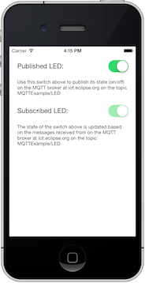

MQTTExample
===========


[](https://travis-ci.org/jmesnil/MQTTExample)

iOS example application using [MQTTKit](https://github.com/jmesnil/MQTTKit).



# Usage

Run ```pod install``` to insall the dependencies (including MQTTKit)
and open `MQTTExample.xcworkpace` to build and run the example.

The app will connect to the MQTT broker hosted at `m2m.eclipse.org` and publish messages on the `/MQTTExample/LED` topic.

The retained message for this topic can be seen at http://eclipse.mqttbridge.com/%2FMQTTExample%2FLED

It is possible to change the state of the LED by publishing messages using eclipse's MQTT bridge:

* switch __on__ the subscribed LED:

<!-- -->
    curl -X PUT --data-binary "1"  http://eclipse.mqttbridge.com/%2FMQTTExample%2FLED


* switch __off__ the subscribed LED:

<!-- -->
    curl -X PUT --data-binary "0"  http://eclipse.mqttbridge.com/%2FMQTTExample%2FLED


Noe that if you used these HTTP calls to change the LED state, the published LED will not necessarily be in the same state than the subscribed LED.